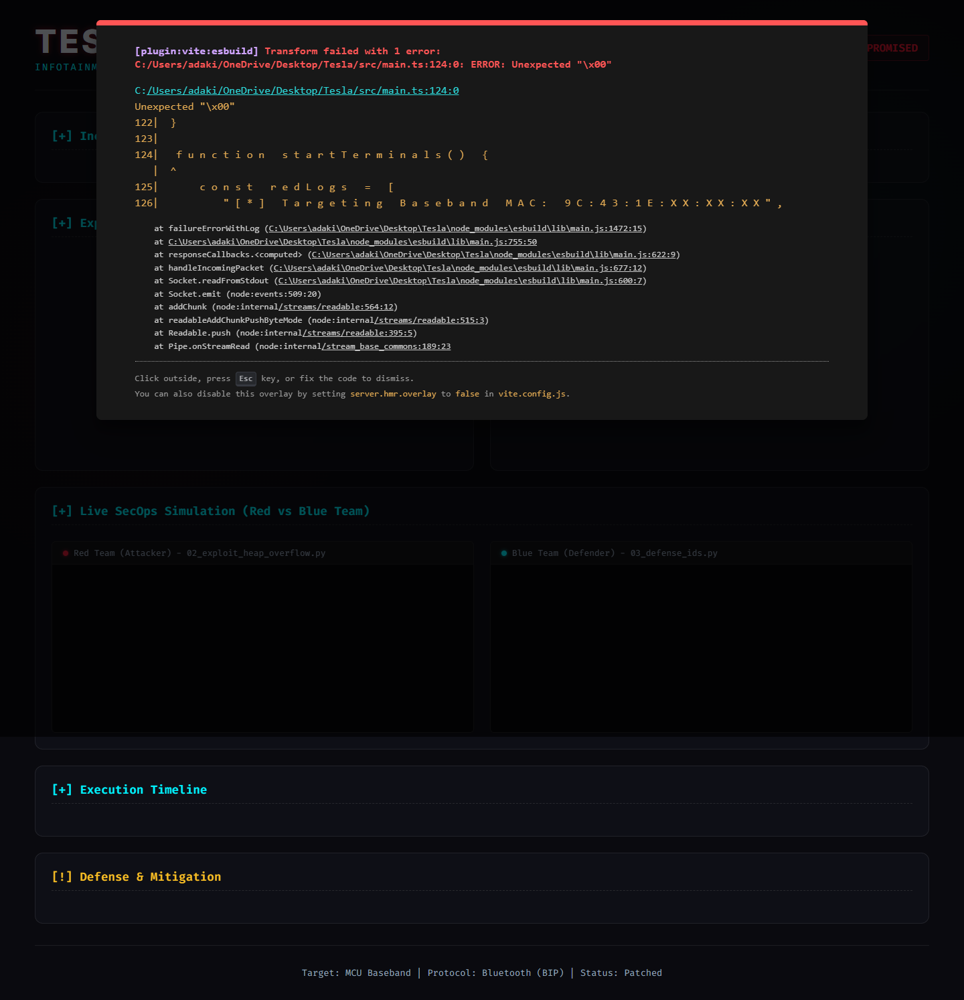

<div align="center">

# 🏎️ Tesla MCU Vulnerability Dashboard (Web & Network Recon PoC)

```text
 _____ _____ ____  _        _      ____   ___   ___ _____ 
|_   _| ____/ ___|| |      / \    |  _ \ / _ \ / _ \_   _|
  | | |  _| \___ \| |     / _ \   | |_) | | | | | | || |  
  | | | |___ ___) | |___ / ___ \  |  _ <| |_| | |_| || |  
  |_| |_____|____/|_____/_/   \_\ |_| \_\\___/ \___/ |_|  
                                                          
```

**Bilgi Güvenliği Teknolojileri - Siber Güvenlik Analizi ve Web PoC Projesi**

[](https://github.com/RedRiveRR/Tesla)
[](https://github.com/RedRiveRR/Tesla)
[-success?style=for-the-badge)](https://github.com/RedRiveRR/Tesla)
[](https://github.com/RedRiveRR/Tesla)
[](https://github.com/RedRiveRR/Tesla)
[](https://github.com/RedRiveRR/Tesla)

</div>

## 📑 Proje Özeti (Abstract)
Bu proje, **Pwn2Own 2023** yarışmasında Synacktiv araştırma ekibi tarafından keşfedilen kritik Tesla Bluetooth (BIP) Baseband zafiyetinin çok boyutlu (multi-dimensional) teknik analizini sunan interaktif bir **Siber Güvenlik Web Gösterge Panelidir (Dashboard)**.

Mevcut sıradan JSON veri tutma sistemlerinden (örneğin `$lib/data/...`) farklı olarak bu repo, elde edilen statik güvenlik verilerini **Glassmorphism**, **Cyberpunk estetiği** ve modern **Vite/TypeScript** teknolojilerini harmanlayarak dinamik olarak oluşturur. Ağ ve donanım zafiyetlerinin modern web teknolojileri (Vanilla JS + CSS) ile nasıl raporlanabileceğine dair akademik bir Proof of Concept (PoC) görevi görür.

## 📸 Arayüz Önizlemesi (Dashboard Preview)
Geliştirilen interaktif Cybersecurity Dashboard'un görsel mimarisi ve karanlık tema tabanlı tasarımı aşağıdaki gibidir:



## ⚙️ Zafiyetin Anatomisi (Vulnerability Mechanics)
Bu projenin görselleştirdiği saldırı zinciri, iki temel hafıza bozulması protokolünün istismarına (exploitation) dayanır:

1. **Heap Buffer Overflow (Yığın Taşması):** Tesla araçlarındaki Bluetooth Imaging Protocol (BIP) uygulanışında, özel olarak hazırlanmış zararlı Bluetooth paketleri kullanılarak Bluetooth çipinde yığın taşmasına neden olunmuştur.
2. **Out-of-Bounds Write (Sınır Dışı Yazma):** Taşma elde edildikten sonra, hafızadaki diğer kritik alanlara veri yazılarak Bluetooth altsisteminden ana bilgi-eğlence (Infotainment - MCU) sistemine "Pivot" işlemi gerçekleştirilmiştir.

## 🚀 Proje Mimarisi ve Kullanılan Teknolojiler
Bu depo sadece bir güvenlik araştırması değil, aynı zamanda üst düzey bir Frontend raporlama aracıdır:

- **Vite & TypeScript:** Hızlı derleme ve tip güvenliği.
- **Vanilla CSS (Glassmorphism):** Saf CSS ile donanım ivmeli arka plan bulanıklıkları ve hacker-temalı estetik.
- **Chart.js Entegrasyonu:** Dinamik radar grafiği ile zafiyet metriklerinin (CVSS) görselleştirilmesi.
- **Modüler Veri Yapısı:** Tüm zafiyet verileri `src/lib/data/` altındaki izole `.json` dosyalarından okunur.
- **Docker Konteynerizasyonu:** Sızma testi laboratuvarı (SecOps) mantığıyla izole edilmiş ağ yapısı.
- **Red/Blue Team Araçları (`scripts/`):** Zafiyeti istismar etmek üzere hazırlanan Python keşif/sömürü kodları ile ağı dinleyip saldırıyı tespit eden IDS savunma betikleri.

## 🛠️ Kurulum ve Test (Saldırı Arayüzü Simülasyonu)

### 1. Yöntem: Docker ile İzole Laboratuvar (Önerilen)
Bu yöntemde, `docker-compose` kullanarak hem hedef paneli hem de saldırgan (attacker) makineyi tek tuşla ağa bağlayabilirsiniz:

```bash
# Projeyi klonlayın
git clone https://github.com/RedRiveRR/Tesla.git
cd Tesla

# İzole laboratuvarı ayağa kaldırın
docker-compose up -d --build
```
*Sunucu başladıktan sonra `http://localhost:5173` adresine giderek arayüze erişebilirsiniz.*

### 2. Yöntem: Standart Geliştirici Ortamı (NPM)
```bash
npm install
npm run dev
```

## ⚔️ Hacker Uçbirimi (Red/Blue Team Scripts)
Proje dizinindeki `scripts/` klasörü, zafiyetin sömürülme ve engellenme anını terminalde simüle eden Python kodları barındırır. Bu betikleri denemek için:

```bash
# Keşif (Recon) işlemini başlatın
python3 scripts/01_recon_bluetooth.py

# Exploit (Saldırı) simülasyonunu çalıştırın
python3 scripts/02_exploit_heap_overflow.py --target "9C:43:1E:XX:XX:XX"

# Saldırı Tespit (IDS / Blue Team) simülasyonunu çalıştırın
python3 scripts/03_defense_ids.py
```

## 🛡️ Savunma Mimarisi (Mitigation)
Tesla, bu zafiyeti tespitinden hemen sonra gelişmiş **Over-The-Air (OTA)** güncelleme sistemi ile uzaktan (OTA Firmware Update) kapatmıştır. Bu tarz donanımsal baseband zafiyetlerine karşı kurumsal düzeyde korunmanın tek yolu donanım sürücülerini sürekli izole (Sandboxing) etmek ve güncel tutmaktır.

---

> **⚠️ Yasal Uyarı ve Etik Bildirim (Disclaimer):**
> Bu depo ve içerisindeki kodlar/analizler, siber güvenlik bilincini arttırmak, modern web teknolojilerinin raporlama aracı olarak kullanımını göstermek ve üniversite seviyesinde akademik araştırma yapmak amacıyla geliştirilmiştir. Yalnızca savunma (Blue Team) ve bilgi amaçlıdır.